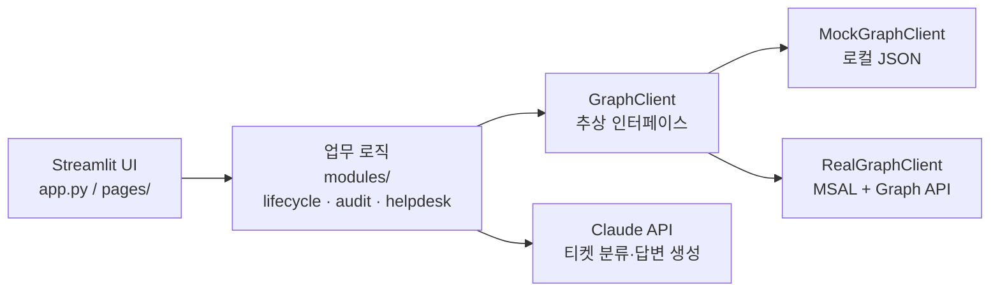

# M365 관리 자동화 툴킷

Microsoft 365 환경에서 IT 인프라 운영 담당자가 반복적으로 처리하는 업무를 자동화하는 Streamlit 대시보드입니다. 여러 관리 포털(Entra 관리센터·Exchange 관리센터·라이선스 포털)을 오가며 수작업으로 처리하던 일을, 하나의 화면에서 한 번에 처리하도록 만들었습니다.

## 왜 만들었나

Microsoft Graph API로 대부분 자동화할 수 있는 작업인데도, 실무에서는 관리자가 여러 관리센터를 오가며 수작업으로 처리하는 경우가 많습니다. 입사자 한 명을 온보딩하는 데도 계정 생성·라이선스 할당·그룹 추가를 각각 다른 화면에서 처리해야 하고, 그 과정에서 단계 하나를 빠뜨리면 보안 문제로 이어지기도 합니다. 이 툴킷은 그런 반복 작업을 스크립트와 대시보드로 대체하는 것을 목표로 합니다.

## 핵심 기능

### 1. 사용자 라이프사이클 자동화
입사자 온보딩(계정 생성 → 라이선스 할당 → 그룹 추가)과 퇴사자 오프보딩(계정 비활성화 → 로그인 세션 강제 종료)을 한 번의 실행으로 처리합니다. 각 단계의 성공/실패를 개별적으로 기록해, 중간에 한 단계가 실패해도 전체를 처음부터 다시 하지 않고 실패한 부분만 확인할 수 있습니다.

### 2. 라이선스·보안 감사 리포트
- **라이선스 사용률**: 구매했지만 배정되지 않은 라이선스(비용 낭비 후보) 자동 집계
- **MFA 미등록 계정**: 보안 위험이 있는 계정 필터링
- **장기 미로그인 계정**: 기준 일수를 슬라이더로 조절해 정리 후보 확인

매달 엑셀로 사용자 목록을 내려받아 눈으로 확인하던 작업을 대체합니다. 모든 리포트는 CSV로 다운로드할 수 있습니다.

### 3. 헬프데스크 어시스턴트 (Claude API)
IT 헬프데스크로 들어오는 문의를 Claude API가 자동으로 분류(카테고리·우선순위·관리자 조치 필요 여부)하고, 담당자가 바로 검토·발송할 수 있는 답변 초안까지 생성합니다. 정해진 JSON 스키마로만 응답하도록 시스템 프롬프트를 설계해, LLM 출력을 안정적으로 파싱할 수 있게 했습니다.

## 아키텍처



업무 로직(`modules/*`)은 `GraphClient` 추상 인터페이스에만 의존합니다. 실제 구현체는 로컬 JSON 기반 `MockGraphClient`와 MSAL 기반 `RealGraphClient` 두 가지이며, `.env`의 `USE_MOCK_GRAPH` 값만 바꾸면 코드 수정 없이 서로 교체됩니다. 이 설계 덕분에 실제 M365 테넌트 없이도 전체 기능을 목업 데이터로 검증할 수 있고, 실 테넌트가 준비되면 그대로 연결됩니다.

## 기술 스택

Python · Streamlit · Microsoft Graph API (MSAL) · Claude API (Anthropic) · pandas · pytest

## 실행 방법

```bash
python -m venv .venv
.venv\Scripts\activate          # macOS/Linux: source .venv/bin/activate
pip install -r requirements.txt

copy .env.example .env          # macOS/Linux: cp .env.example .env
# .env에 ANTHROPIC_API_KEY 입력 (헬프데스크 기능에 필요)

streamlit run app.py
```

기본값(`USE_MOCK_GRAPH=true`)으로 실행하면 실제 M365 테넌트 없이 목업 데이터(사용자 8명, 라이선스 3종)로 전체 기능을 바로 체험할 수 있습니다.

## 테스트

```bash
pytest
```

목업 클라이언트를 기준으로 온보딩·오프보딩·감사 리포트 로직을 검증합니다.

## 실제 M365 테넌트 연동하기

1. [Microsoft 365 Developer Program](https://developer.microsoft.com/microsoft-365/dev-program) 또는 30일 체험판으로 테넌트 준비
2. [Entra 관리센터](https://entra.microsoft.com) → **앱 등록(App registrations)** → 새 등록
3. **API 권한**에서 Application 권한 추가 후 관리자 동의: `User.ReadWrite.All`, `Group.ReadWrite.All`, `Directory.Read.All`, `Reports.Read.All`
4. **인증서 및 암호(Certificates & secrets)** → 새 클라이언트 암호 생성
5. `.env`에 `USE_MOCK_GRAPH=false`와 함께 `GRAPH_TENANT_ID`, `GRAPH_CLIENT_ID`, `GRAPH_CLIENT_SECRET` 입력

코드 변경 없이 `graph/real_client.py`가 자동으로 사용됩니다.

## 향후 개선 아이디어

- Teams 웹훅 연동으로 감사 리포트 정기 알림 발송
- Intune 기기 컴플라이언스 현황 모듈 추가
- 온보딩/오프보딩 승인 워크플로 (담당자 승인 후 실행)
